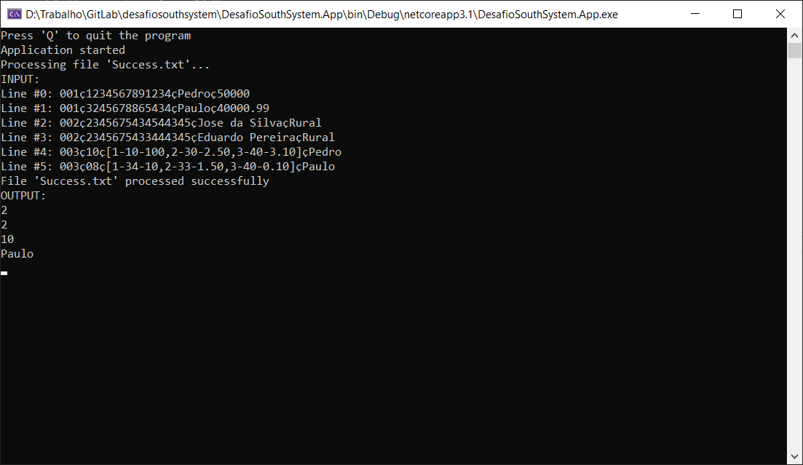
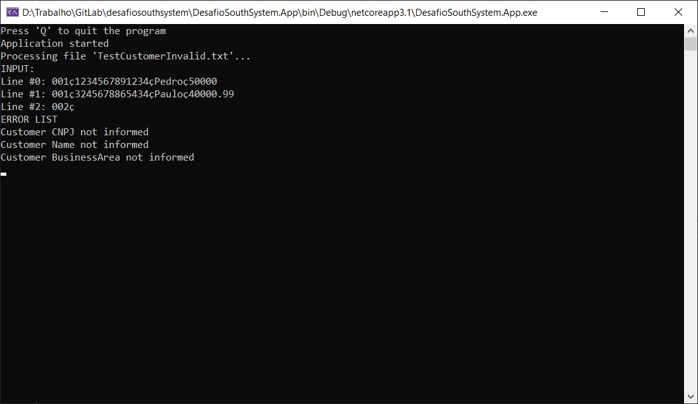

# DesafioSouthSystem

Resolução do desafio proposto pela South System: [link](https://github.com/rh-southsystem/desafio-dot-net)

## PROJETOS DA SOLUÇÃO

• **DesafioSouthSystem.App**: Console Application. Uma vez que seja executado, funcionará sem interação do usuário. A todo momento, monitora os arquivos de texto depositados no diretório "%HOMEPATH%/data/in", processando seus dados e salvando o resultado em um novo arquivo no diretório "%HOMEPATH%/data/out".

• **DesafioSouthSystem.Domain**: Biblioteca. Contém as entidades, commands, queries, handlers e validações utilizados pelos demais projetos.

• **DesafioSouthSystem.Shared**: Biblioteca. Possui classes comuns a todos os projetos.

• **DesafioSouthSystem.Tests**: Testes automatizados. Permite testar os commands e queries do projetos App e WebAPI.

• **DesafioSouthSystem.WebAPI**: Web API. Permite fazer download e upload de arquivos de texto.

## TECH STACK

- .NET Core 3.1
- Swagger
- AutoMapper
- MediatR
- FluentValidation
- xUnit
- AutoMoq

## PATTERNS/DESIGNS

- S.O.L.I.D.
- CQRS
- Domain Driven Design
- Notification Pattern

## INSTRUÇÕES

A solução contém dois projetos que devem ser executados simultaneamente: **DesafioSouthSystem.App** e **DesafioSouthSystem.WebAPI**.  
A Web API abre no navegador uma página web contendo o Swagger que permite executar os métodos de download e upload.  
O console irá escrever o conteúdo dos arquivos publicados na pasta de entrada e o conteúdo obtido nos arquivos gerados na pasta de saída. Em caso de erro, as mensagens serão escritas e o processamento do arquivo será interrompido.  
Não será necessário parar a execução do console antes de se fazer upload de outro arquivo, pois o monitoramento é contínuo.  
Para fechar o console, basta pressionar a tecla "Q".

## OBSERVAÇÕES

Na máquina em que este sistema foi desenvolvido, o valor da variável de ambiente "HOMEPATH" não possui o disco padrão, portanto foi necessário coletar a variável de ambiente "HOMEDRIVE" para ter-se o caminho completo.  
Caso o computador que execute este sistema possua o "HOMEPATH" com o endereço completo, será necessário alterar a variável "IsHomePathComplete" de _false_ para _true_ nos arquivos _appsettings.json_ dos projetos **DesafioSouthSystem.App** e **DesafioSouthSystem.WebAPI**.

## EXEMPLOS

**Sucesso**

**Erro**

